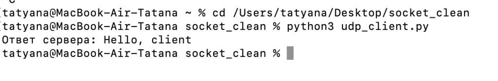
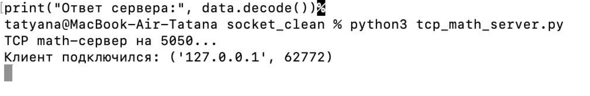
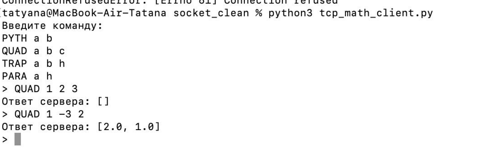
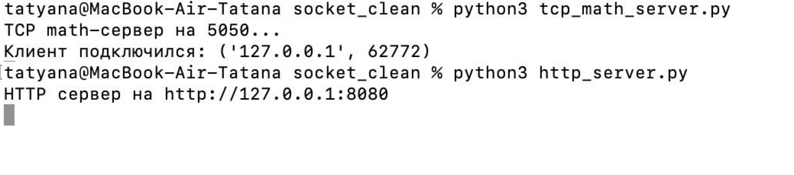
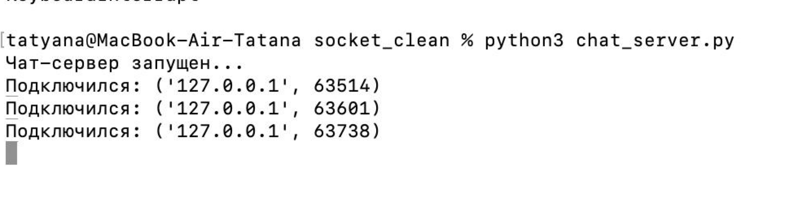
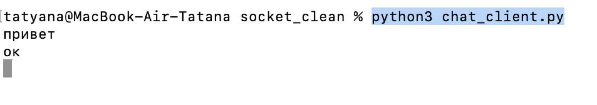
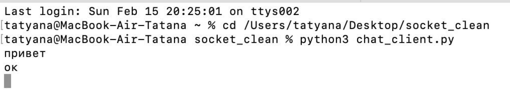
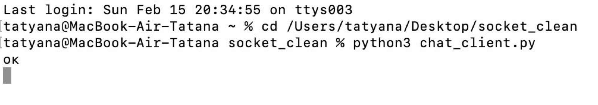
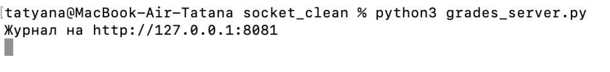
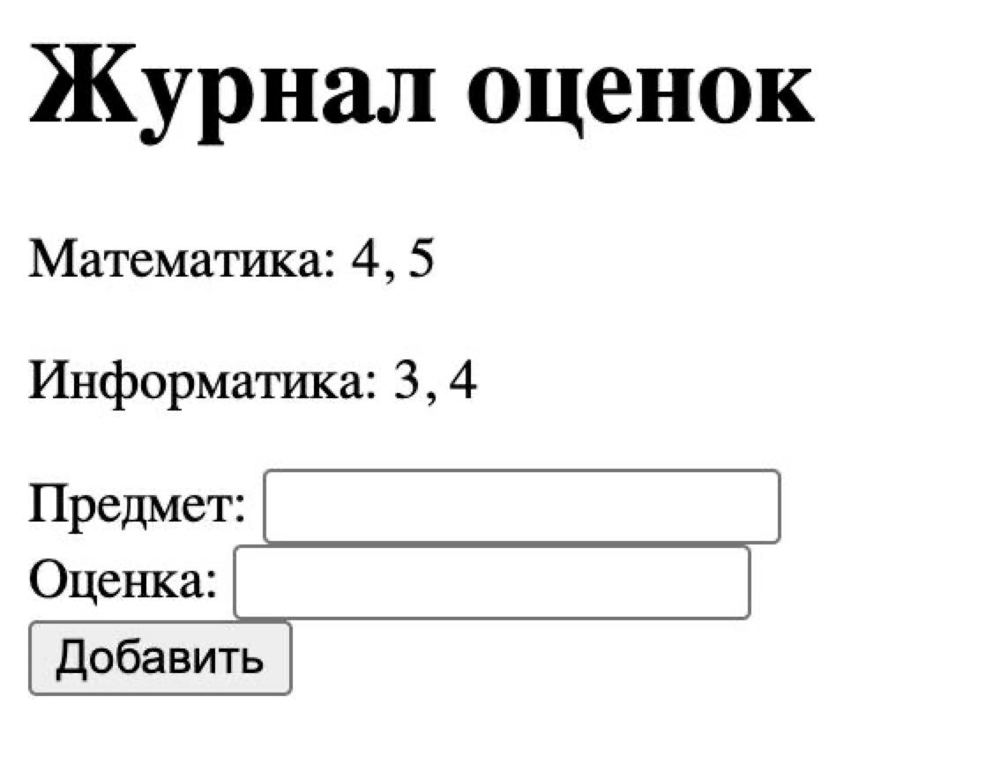

# Отчёт по лабораторной работе

## Работа с сокетами в Python

**Студент:** Цветкова Татьяна Александровна
**Группа:** К3341

# Цель работы

Изучить принципы сетевого взаимодействия между клиентом и сервером с использованием библиотеки `socket` в языке программирования Python.
Получить практические навыки реализации приложений на основе протоколов **UDP**, **TCP**, а также создания простого **HTTP-сервера**, **многопользовательского чата** и **веб-журнала оценок**.

# Задание 1 — UDP клиент-сервер

## Описание

В рамках задания была реализована простая модель взаимодействия клиента и сервера по протоколу **UDP**.
Клиент отправляет серверу сообщение **«Hello, server»**, сервер принимает сообщение и выводит его в консоль, после чего отправляет клиенту ответ **«Hello, client»**, который отображается на стороне клиента.

Протокол UDP выбран, поскольку он не требует установления соединения и обеспечивает быструю передачу данных без гарантии доставки.

## Результат

Соединение между клиентом и сервером успешно установлено, обмен сообщениями выполнен корректно.

# Задание 2 — TCP сервер математических вычислений

## Описание

Было реализовано клиент-серверное приложение на основе протокола **TCP**, обеспечивающего надёжную передачу данных и установление соединения.

Сервер принимает от клиента команды для выполнения математических операций:

* вычисление гипотенузы по **теореме Пифагора** (`PYTH`);
* решение **квадратного уравнения** (`QUAD`);
* вычисление **площади трапеции** (`TRAP`);
* вычисление **площади параллелограмма** (`PARA`).

Клиент вводит команду с параметрами, сервер выполняет вычисление и отправляет результат обратно.

## Результат

Передача данных по TCP-соединению работает корректно.
Сервер успешно обрабатывает все предусмотренные команды и возвращает правильные результаты вычислений.

# Задание 3 — HTTP-сервер и HTML-страница

## Описание

Был реализован простой **HTTP-сервер** с использованием библиотеки `socket` без применения веб-фреймворков.
Сервер принимает HTTP-запрос от браузера и возвращает HTML-страницу, загружаемую из файла `index.html`.

Таким образом продемонстрирована базовая работа протокола **HTTP поверх TCP-соединения**.

## Результат

При переходе в браузере по адресу
`http://127.0.0.1:8080`
отображается HTML-страница, сформированная сервером.

# Задание 4 — Многопользовательский чат

## Описание

Разработан **многопользовательский чат** на основе протокола **TCP** с использованием библиотеки `threading`.

Особенности реализации:

* сервер принимает подключения нескольких клиентов;
* для каждого клиента создаётся отдельный поток;
* сообщения одного пользователя пересылаются всем остальным участникам чата;
* обеспечивается одновременная работа нескольких клиентов.

Использование потоков позволяет серверу обслуживать несколько соединений параллельно без блокировки.

## Результат

Несколько клиентов успешно подключаются к серверу и обмениваются сообщениями в реальном времени.

# Задание 5 — Веб-журнал оценок (GET/POST)

## Описание

Был реализован простой **веб-сервер** для обработки HTTP-запросов методов **GET** и **POST**.

Функциональность:

* добавление дисциплины и оценки через HTML-форму;
* хранение оценок в структурированном виде (список оценок для каждой дисциплины);
* отображение всех дисциплин и соответствующих им оценок на HTML-странице.

Реализация выполнена исключительно с использованием библиотеки `socket`.

## Результат

После добавления нескольких оценок по одной дисциплине они отображаются **в одной строке списком**, что соответствует требованиям задания.

 
# Вывод

В ходе выполнения лабораторной работы были изучены основы сетевого взаимодействия в Python с использованием библиотеки `socket`.
Были реализованы приложения на основе протоколов **UDP**, **TCP**, **HTTP**, а также создан **многопользовательский чат** и **веб-журнал оценок**.

Полученные навыки позволяют понимать принципы работы клиент-серверных приложений, сетевых протоколов и обработки HTTP-запросов на низком уровне без использования сторонних фреймворков.
