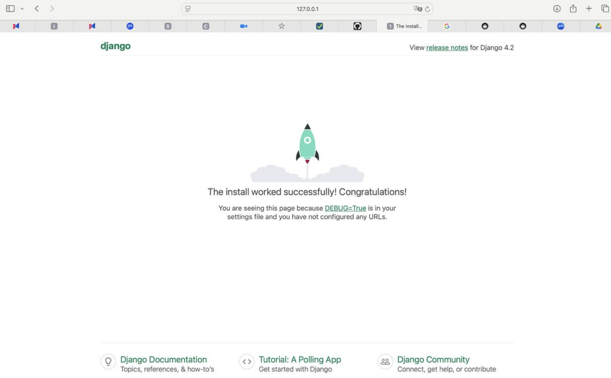
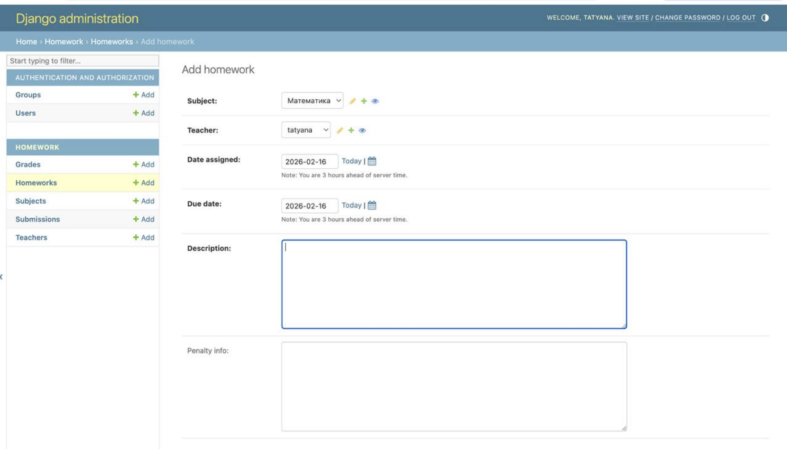
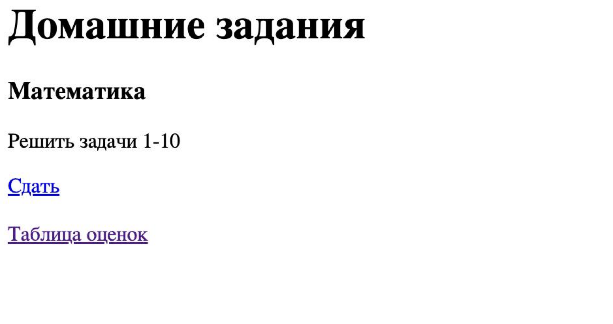
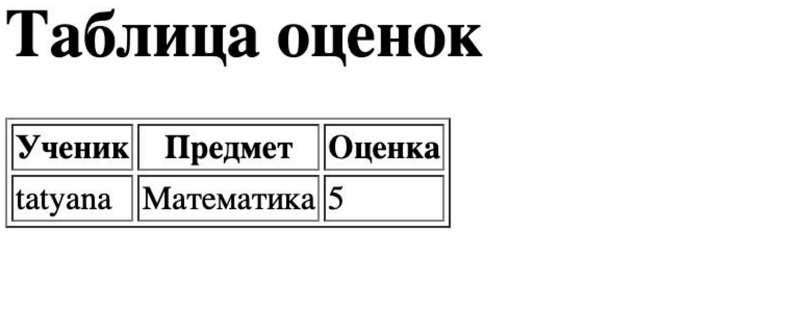

# Лабораторная работа №2

## Реализация web-сайта средствами Django

**Студент:** Цветкова Татьяна
**Группа:** k3341

# Цель работы

Получение практических навыков разработки web-приложений с использованием фреймворка **Django**, работы с базой данных, административной панелью и пользовательским интерфейсом.

# Постановка задачи

Необходимо реализовать web-сайт **«Доска домашних заданий»**, который должен обеспечивать:

* регистрацию пользователей
* просмотр списка домашних заданий
* сдачу домашних заданий в текстовом виде
* выставление оценок преподавателем через Django-admin
* отображение таблицы оценок учеников

# Используемые технологии

В ходе выполнения лабораторной работы использовались:

* язык программирования **Python 3**
* web-фреймворк **Django 4**
* база данных **SQLite**
* шаблоны **HTML**
* система контроля версий **Git**
* генератор документации **MkDocs**

# Реализация системы

## 1. Главная страница Django

После запуска сервера Django отображается стандартная стартовая страница, подтверждающая корректную установку и настройку проекта.

## 2. Административная панель

Через административную панель Django реализовано:

* добавление предметов
* добавление преподавателей
* создание домашних заданий
* просмотр отправленных решений
* выставление оценок

## 3. Просмотр домашних заданий

На клиентской странице пользователь может:

* увидеть список домашних заданий
* открыть форму сдачи задания
* перейти к таблице оценок

## 4. Таблица оценок

После проверки задания преподавателем на сайте отображается таблица, содержащая:

* имя ученика
* предмет
* полученную оценку

# Результат выполнения работы

В результате выполнения лабораторной работы был разработан web-сайт на Django, реализующий систему:

* хранения домашних заданий
* сдачи решений пользователями
* проверки работ преподавателем
* отображения оценок в пользовательском интерфейсе

Все требуемые функции задания реализованы и корректно работают.

# Вывод

В ходе выполнения лабораторной работы были получены практические навыки:

* создания проектов и приложений Django
* работы с моделями и базой данных
* настройки маршрутизации и шаблонов
* использования административной панели
* организации структуры проекта
* подготовки отчёта с использованием **Markdown** и **MkDocs**

Разработанное приложение полностью соответствует поставленной задаче.
