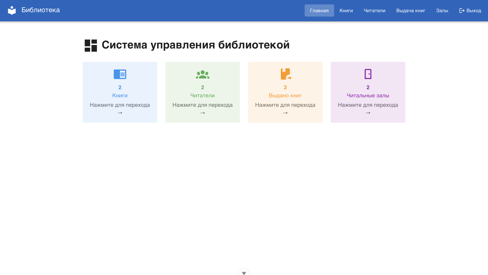
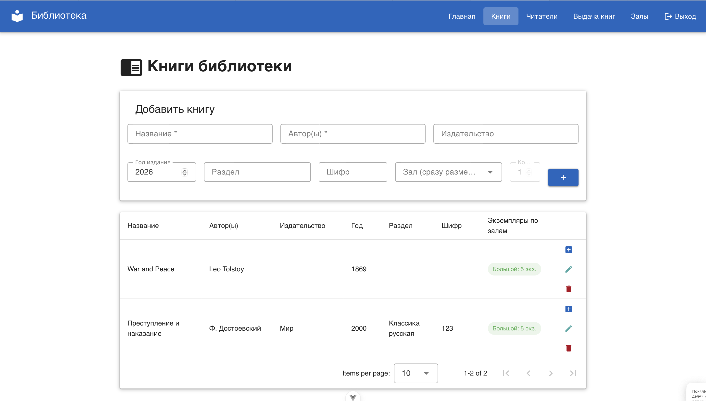
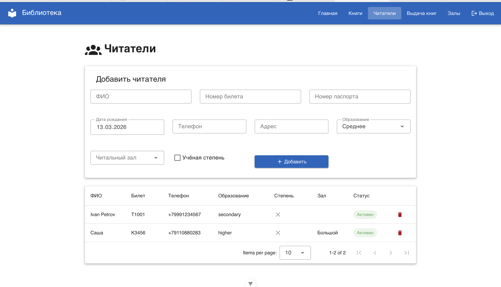
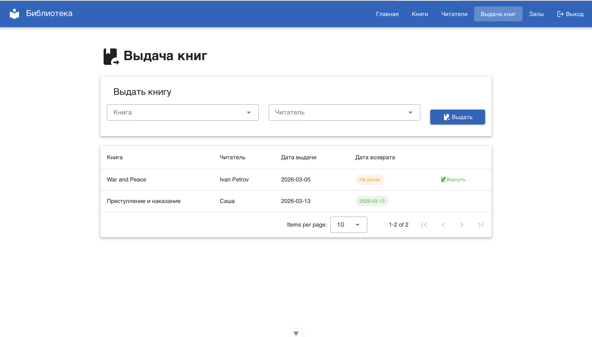

# Лабораторная работа №4

**Студент:** Цветкова Татьяна
**Группа:** K3341
**Дата:** 13.03.2026

---

## Тема

Разработка клиентской части (фронтенд) системы управления библиотекой с использованием Vue 3, Vuetify и взаимодействием с REST API, реализованным в лабораторной работе №3.

---

## Цели работы

1. Настроить CORS (Cross-Origin Resource Sharing) для серверной части из лабораторной работы №3, чтобы Vue-приложение могло делать запросы к Django.
2. Реализовать интерфейсы авторизации, регистрации и выхода из системы с взаимодействием с токен-авторизацией через Djoser.
3. Реализовать клиентские интерфейсы для работы со всеми сущностями предметной области (книги, читатели, залы, выдача книг).
4. Подключить библиотеку компонентов Vuetify для оформления интерфейса.

---

## Задачи

- Настроить CORS в Django с помощью библиотеки `django-cors-headers`.
- Создать Vue 3 приложение с помощью Vite.
- Подключить Vue Router для навигации между страницами (SPA — Single Page Application).
- Реализовать страницы: вход, регистрация, главная (дашборд), книги, читатели, выдача книг, читальные залы.
- Настроить защиту маршрутов (навигационный guard) — незарегистрированный пользователь не имеет доступа к страницам системы.
- Настроить взаимодействие с API через библиотеку `axios`.
- Подключить Vuetify 4 и использовать компоненты: `v-data-table`, `v-card`, `v-form`, `v-select`, `v-alert`, `v-chip`.

---

## Используемые технологии

| Технология | Назначение |
|---|---|
| **Vue 3** | JavaScript-фреймворк для построения реактивного UI |
| **Vite** | Инструмент сборки и dev-сервер |
| **Vue Router 5** | Клиентская маршрутизация (SPA) |
| **Vuetify 4** | Библиотека UI-компонентов в стиле Material Design |
| **Axios** | HTTP-клиент для запросов к Django REST API |
| **Django CORS Headers** | Разрешение запросов с другого домена/порта |
| **Djoser** | Аутентификация по токенам на стороне Django |

---

## Настройка CORS

Для того чтобы фронтенд на `localhost:5173` мог обращаться к бэкенду на `localhost:8000`, необходимо настроить CORS.

**Установка:**
```bash
pip install django-cors-headers
```

**settings.py:**
```python
INSTALLED_APPS = [
    ...
    'corsheaders',
]

MIDDLEWARE = [
    'corsheaders.middleware.CorsMiddleware',  # должен быть первым
    ...
]

# Разрешаем запросы со всех источников (для разработки)
CORS_ALLOW_ALL_ORIGINS = True
```

---

## Структура проекта

```
library-frontend/
├── src/
│   ├── main.js            # точка входа, подключение Vuetify и Router
│   ├── App.vue            # корневой компонент, навигационная шапка
│   ├── router.js          # маршруты и навигационный guard
│   └── views/
│       ├── Login.vue      # страница входа
│       ├── Register.vue   # страница регистрации
│       ├── Dashboard.vue  # главная страница со статистикой
│       ├── Books.vue      # управление книгами
│       ├── Readers.vue    # управление читателями
│       ├── Borrowings.vue # выдача и возврат книг
│       └── Rooms.vue      # читальные залы
└── vite.config.js
```

---

## Маршрутизация (Vue Router)

Маршруты описаны в `router.js`. Используется `createWebHistory` — URL без символа `#`.

```js
const routes = [
  { path: '/',           redirect: '/login' },
  { path: '/login',      component: Login },
  { path: '/register',   component: Register },
  { path: '/dashboard',  component: Dashboard,  meta: { requiresAuth: true } },
  { path: '/books',      component: Books,      meta: { requiresAuth: true } },
  { path: '/readers',    component: Readers,    meta: { requiresAuth: true } },
  { path: '/borrowings', component: Borrowings, meta: { requiresAuth: true } },
  { path: '/rooms',      component: Rooms,      meta: { requiresAuth: true } },
]
```

**Навигационный guard** проверяет наличие токена перед переходом на защищённую страницу:

```js
router.beforeEach((to, _from, next) => {
  if (to.meta.requiresAuth && !localStorage.getItem('token')) {
    next('/login')   // нет токена → на страницу входа
  } else {
    next()           // токен есть → разрешаем
  }
})
```

---

## Авторизация

Авторизация реализована через **Djoser** (библиотека для Django REST Framework).

**Эндпоинты:**

| Метод | URL | Описание |
|---|---|---|
| `POST` | `/auth/users/` | Регистрация нового пользователя |
| `POST` | `/auth/token/login/` | Получение токена (вход) |
| `POST` | `/auth/token/logout/` | Инвалидация токена (выход) |

**Пример запроса входа (Login.vue):**
```js
const res = await axios.post('http://127.0.0.1:8000/auth/token/login/', {
  username: this.username,
  password: this.password,
})
// Сохраняем токен для дальнейших запросов
localStorage.setItem('token', res.data.auth_token)
```

**Все последующие запросы к API** отправляются с заголовком:
```
Authorization: Token <токен>
```

---

## Ход работы

### 1. Главная страница (Dashboard)

На главной странице отображается статистика системы: количество книг, читателей, выданных книг и читальных залов. Данные загружаются параллельно с помощью `Promise.all`:

```js
const [books, readers, borrowings, rooms] = await Promise.all([
  axios.get('/api/books/',     { headers }),
  axios.get('/api/readers/',   { headers }),
  axios.get('/api/borrowings/',{ headers }),
  axios.get('/api/rooms/',     { headers }),
])
```

Каждая карточка является кликабельной ссылкой, ведущей на соответствующий раздел.



---

### 2. Страница «Книги»

На странице реализованы:

- **Форма добавления книги** — название, авторы, издательство, год, раздел, шифр, выбор зала и количество экземпляров.
- **Таблица книг** с использованием компонента `v-data-table` (встроенная пагинация и сортировка).
- **Управление экземплярами** — для каждой книги видно, в каком зале сколько копий; можно добавить или изменить количество.
- **Удаление книги** через кнопку с иконкой корзины.

Добавление книги (POST-запрос):
```js
await axios.post('http://127.0.0.1:8000/api/books/', this.form, { headers })
```



---

### 3. Страница «Читатели»

На странице реализованы:

- **Форма добавления читателя** — ФИО, номер билета, паспорт, дата рождения, телефон, адрес, уровень образования, учёная степень, привязка к залу.
- **Таблица читателей** с цветными чипами для статуса (активен/выбыл) и галочками для учёной степени.
- **Удаление читателя**.



---

### 4. Страница «Выдача книг»

На странице реализованы:

- **Форма выдачи** — выбор книги и читателя из выпадающих списков, кнопка «Выдать».
- **Таблица выдач** — видно кому и когда выдана книга, статус (на руках / дата возврата).
- **Возврат книги** — кнопка «Вернуть» отправляет PATCH-запрос с текущей датой.

Логика выдачи на стороне сервера (views.py):
- При выдаче: проверяется наличие свободных экземпляров (`BookCopy.quantity > 0`), затем количество уменьшается на 1.
- При возврате: количество экземпляров увеличивается на 1.



---

## API-эндпоинты (бэкенд)

| Метод | Эндпоинт | Описание |
|---|---|---|
| GET/POST | `/api/books/` | Список книг / добавить книгу |
| GET/PUT/DELETE | `/api/books/{id}/` | Одна книга |
| GET/POST | `/api/readers/` | Список читателей / добавить |
| GET/PUT/DELETE | `/api/readers/{id}/` | Один читатель |
| GET/POST | `/api/bookcopies/` | Экземпляры книг по залам |
| GET/POST | `/api/borrowings/` | Выдача книг |
| PATCH | `/api/borrowings/{id}/` | Возврат книги |
| GET/POST | `/api/rooms/` | Читальные залы |

---

## Выводы

В ходе лабораторной работы была реализована полноценная клиентская часть системы управления библиотекой. Применён стек Vue 3 + Vuetify + Axios + Vue Router. Настроен CORS для взаимодействия фронтенда с Django REST Framework. Реализована токен-авторизация через Djoser. Все операции (добавление, просмотр, удаление, выдача, возврат) работают через REST API без перезагрузки страницы (SPA).
